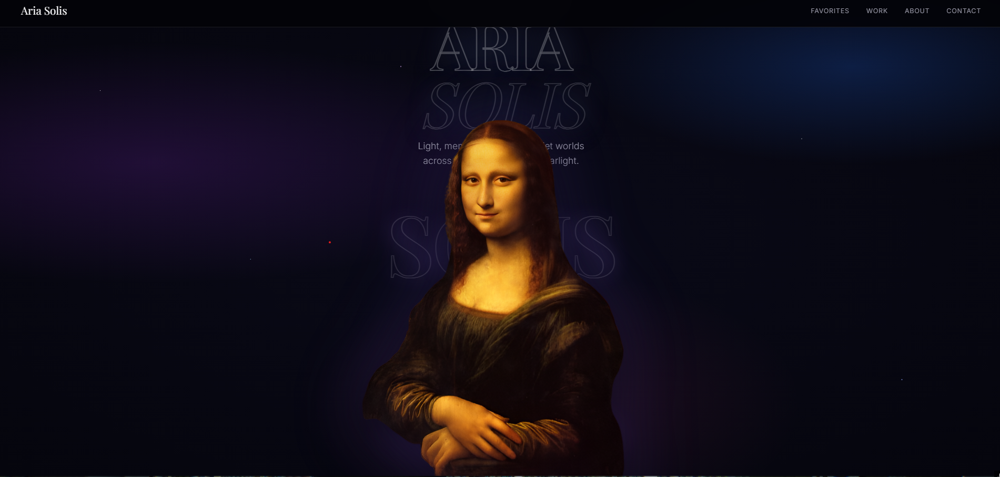

# 🌌 Aria Solis – Premium Photography Portfolio

A luxurious and immersive photography portfolio built with **HTML, CSS, JavaScript, and Three.js**. This project combines elegant design, cinematic animations, and an interactive 3D gallery to create a memorable user experience.



## ✨ Features

- 🌌 Interactive 3D galaxy gallery powered by Three.js
- 📸 Beautiful photography portfolio layout
- 🎨 Premium dark theme with glassmorphism
- ✨ Smooth page animations and transitions
- 🖼️ Responsive image gallery with modal preview
- 🍔 Animated mobile navigation
- 📱 Fully responsive on desktop, tablet, and mobile
- 💌 Contact form integration (Formspree)
- ⚡ Fast, lightweight, and dependency-free (except Three.js CDN)

---

## 🛠️ Technologies Used

- HTML5
- CSS3
- JavaScript (ES6)
- Three.js
- Google Fonts

---

## 📂 Project Structure

```
.
├── index.html
├── assets/
│   ├── images/
│   ├── icons/
│   └── preview.png
├── README.md
└── LICENSE
```

---

## 🚀 Getting Started

Clone the repository:

```bash
git clone https://github.com/yourusername/aria-solis-portfolio.git
```

Open the project:

```bash
cd aria-solis-portfolio
```

Simply open `index.html` in your browser or run a local server.

Using VS Code Live Server:

```bash
Right Click → Open with Live Server
```

---

## 📸 Highlights

- Elegant hero section
- Interactive 3D favorite photos orbit
- Modern glassmorphism interface
- Responsive portfolio grid
- Animated image modal
- Premium typography
- Smooth scrolling experience
- Mobile-first navigation

---

## 📧 Contact Form

The contact form uses **Formspree**.

Replace:

```html
https://formspree.io/f/YOUR_FORM_ID
```

with your own Formspree endpoint.

---

## 📱 Responsive

Optimized for:

- Desktop
- Laptop
- Tablet
- Mobile

---

## 🎯 Performance

- Lightweight vanilla JavaScript
- Optimized animations
- Lazy-loaded images
- Hardware accelerated CSS effects

---

## 📜 License

This project is licensed under the MIT License.

---

## 👨‍💻 Author

Designed & Developed with ❤️

If you enjoyed this project, consider giving it a ⭐ on GitHub.
